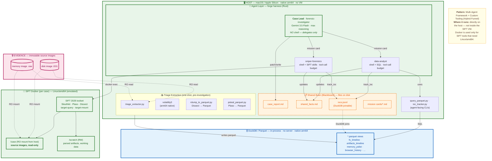

# DuckTracy — Architecture

- **Pattern:** Multi-Agent Framework + Custom Tooling (Hybrid Funnel)
- **Hackathon tracks:** spans #1 (Direct Agent Extension) and #3 (Multi-Agent Frameworks)
- **Goals:** Speed plus AI creativity while enforcing forensic integrity

> **Where this runs:** directly on the analyst's host — *not* inside the SIFT VM. Docker is used only for the subset of SIFT tools that need Linux/amd64. This deliberately combines the best of both worlds: SIFT's breadth of tools while taking advantage of native Apple Silicon performance, DuckDB's in-process query speed, and modern data-science formats (Parquet).

## Diagram

## Where it runs

| Zone | Runtime | Why this placement |
|---|---|---|
| **Host (macOS, arm64)** | Native, no VM | Apple Silicon performance; forge harness, extraction pipeline, blackboard files, and helper CLIs all run here |
| **DuckDB / Parquet** | In-process on host | No server, no daemon, in-memory speed; agent queries are local SQL |
| **SIFT Docker (one instance per case)** | Linux/amd64 (emulated) | Used for SIFT tools that don't run natively or benefit from SIFT packaging (Sleuthkit, Plaso, Dissect, target-query) |
| **Evidence** | Host filesystem, RO into container | Source images mounted read-only at `/case` inside the container |

## Trust boundaries

The hackathon brief asks specifically that architectural enforcement and prompt-based / SOP enforcement be distinguished. Here is every boundary in the system, classified.

| Boundary | Type | How it's enforced | Failure mode if violated |
|---|---|---|---|
| Source images cannot be mutated by agents | 🟢 Architectural | Host case directory mounted as `mode: "ro"` into `/case` inside Docker container (`helpers/sift_tools.py:77`). Triage extractor reads images via the same RO path. | Container would need to be killed and restarted with RW mount; agents have no path to do that. |
| Case Lead cannot run arbitrary shell commands | 🟢 Architectural | The `forensic-investigator` agent's `tools:` list in `.forge/agents/forensic-investigator.md` deliberately omits `shell`. The forge harness will not surface a tool the agent definition does not declare. | Lead would need its definition edited; it cannot acquire shell at runtime. |
| Sub-agents bounded by tool-call budget | 🟢 Architectural (forge) + 🟠 Prompt (mission cards) | `max_turns: 75` and `max_requests_per_turn: 75` in `.forge/agents/data-analyst.md` are hard-enforced by forge. Mission cards add a per-mission soft budget; agents are instructed to reject missions that don't include one. | If the mission-card budget is ignored, the forge hard cap still terminates the turn. |
| `rm` requires confirmation | 🟢 Architectural | `.forge/permissions.yaml` policy: `rm*` → `confirm`. | `rm` calls require interactive approval; cannot run unattended. |
| Blackboard updates (`shared_facts.md`, `iocs.jsonl`, `case_report.md`) | 🟠 Prompt / SOP | Agents are instructed by `shared-facts-sop` and the case-lead "Update-First Mandate" to write after every finding. Nothing in code forces this. | Findings stay in mission card transcripts; no data loss, but cross-agent coordination degrades. Case lead would notice missing facts and re-delegate. |
| Sub-agent scope discipline | 🟠 Prompt / SOP | Each sub-agent prompt: *"ONLY perform the requested analysis. Do NOT attempt to analyze the entire case or pivot to unrelated artifacts."* | If ignored, the agent burns its tool-call budget on tangents; the budget cap (architectural) is the backstop. |
| In-container command execution | 🟠 Permission policy | `.forge/permissions.yaml` allows `command: "*"`. Agents can run any shell command inside the SIFT container. | The RO mount on `/case` is what actually protects evidence integrity, not the permission policy. Documented honestly here: the architectural protection lives at the mount layer, not the command-allowlist layer. |

## Why this architecture

The hackathon's reference architecture appears to assume everything runs inside the SIFT VM. DuckTracy intentionally inverts this:

1. **Speed.** DuckDB in-process on Apple Silicon processes millions of forensic events in milliseconds. The same workload inside the SIFT VM is slower by an order of magnitude.
2. **Data-science substrate.** Parquet + DuckDB lets AI agents query in SQL — a language they already know fluently — instead of learning a bespoke MCP tool surface.
3. **Containment by isolation, not by VM.** Source images are protected by a read-only Docker mount, not by VM-level segregation. The Docker boundary is sufficient for evidence integrity and lighter than a full VM.
4. **SIFT toolset preserved.** The SIFT container still provides Sleuthkit, Plaso, but adds new utilities such as the Dissect series of target-query, etc. Agents reach them via `docker exec` and consistently rate the interaction as "feeling native."

This architecture is the project's central design thesis. The agent's preference for SQL + native shell over MCP was validated through per-iteration agent NPS feedback.
