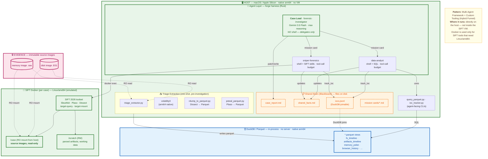

# AI Forensics

## Architecture (at a glance)



DuckTracy runs **on the host directly** — not inside a SIFT VM. Docker is used only for the subset of SIFT tools that need Linux/amd64; DuckDB queries Parquet in-process for speed; agents query through familiar SQL and shell instead of a custom MCP surface. See [ARCHITECTURE.md](./ARCHITECTURE.md) for trust boundaries, the architectural pattern, and why this diverges from the default SIFT VM setup.

## What
DuckTracy (a nod to Daffy's character and our use of DuckDB) is a structured way to perform forensics using a discrete set of tooling: 

### SIFT
The SIFT workstation from SANS is a battle-tested collection of tried and true forensic utilities. We use it as a docker container to: 

- Run multiple containers in parallel (one per case, allowing multiple cases to be worked at once)
- Make choices about using tool versions in the container, or locally
- Allow AI an easy CLI interface into the vast set of tools

### Forgecode
Forgecode.dev (or forge) is an AI harness written in rust that allows

- Easy agent creation (a simple .md file)
- Agents to be pointed at any provider/model (a lead investigator using a powerful thinking model, a worker using an efficient flash model)
- Agents to operate as a team
- Agents to operate at scale, instantiating many at a time

### Dissect/Triage-query
The dissect set of utilities https://docs.dissect.tools/en/latest/index.html are a python-based forensics suite that reads any file as a source of forensic data and allows consistent parsing of artifacts. Rather than an individual tool per file type, it offers AI a consistent way to retrieve and parse artifacts adhoc. 

### DuckDB
AI is notoriously bad at navigating large context like we experience in forensics, but notoriously good at data science especially with SQL. 

We purposefully build a pipeline for artifacts to go from raw form to .parquet files with a semi-structured schema, presented as a query utility for AI. This allows extremely rapid and repeatable discovery and analysis by AI in an environment it knows well. DuckDB is local only, no servers needed and is capable of dynamically stitching together .parquet, .sqlite, .jsonl and other files which gives us an adhoc environment we can add data as needed.

## Getting started. 

- Clone this repo
- Pull the docker container `docker pull 0x7eff/sift-ai`
- Install `uv` for the python environment [DOCS](https://docs.astral.sh/uv/getting-started/installation/)
- Install the libraries `uv sync`
- Optional: `source .venv/bin/activate` to activate the python environment, or run utilities with `uv run <something.py>`.
- Install forge, login with your AI provider and choose your models. 
  ```
  curl -fsSL https://forgecode.dev/cli | sh
  forge
  /login
  ```
  NOTE that the current configuration assumes Google Gemini via VertexAI. You can use any provider/model, but you will need to edit the ./.forge/agents/*.md files to match your intentions
  ```
  provider: vertex_ai
  model: gemini-3.5-flash
  ```

- Create a directory to hold your case images: `mkdir -p ./cases/<CASE_ID>/images`
- Copy in your disk/memory images (by convention `<hostname-disc|memory>.<filetype>` ) 
    - Where filetype is .E01 for expert witness files, .img for memory images, .dd or .raw for raw images. 
    - Files without the word `memory` in the name will be considered disk images and mounted. 
    - Files with the word `memory` in the name will be processed as memory images. 
- Initialize the case `uv run init_case.py --case <CASE_ID> ./cases/<CASE_ID>/images/*
- Initialize processing the case files: 
    - Process all images: `uv run triage_extractor.py --case <CASE_ID> --all`
    - Process selected images (or new images as they arrive): `uv run triage_extractor.py --case <CASE_ID> --evidence ./cases/<CASE_ID>/images/*memory*`

This will kick off a series of artifact gathering for: 
- file system timelines (a custom duckDB version of mactime)
- log2timeline/plaso extraction of key targets (a custom psteal.py to parquet): 
    - WindowsRunKeys,
    - WindowsServices,
    - WindowsUserAssist,
    - WindowsAppCompatCache,
    - WindowsEventLogSecurity,
    - WindowsEventLogSystem,
    - WindowsXMLEventLogSecurity,
    - WindowsXMLEventLogSystem,
    - WindowsPrefetchFiles
    - LNK files
    - etc
- volatility
    - pslist
    - netstat
    - timeliner (select plugins for value of artfact)

All of these will be converted to .parquet files with a common schema. Your investigation canvas is now ready for AI. 

(PCAP to parquet is also supported but will be run adhoc by agents as needed.)

## Engage AI

```shell 
forge
```

`/new` Will start a forge session. 

`/agent` To choose the `forensic-investigator`

Prompt with whatever you think it needed to start the case (at least the `CASEID`)

You can monitor the case progress by watching the `docs` directory in the CASEID folder and by communicating with the lead agent for the forge CLI. 

You can interrupt the lead agent at any time with a CTRL-c. 

You can always redirect the lead or subagents through the command line interface. They are autonomous by instinct, but appreciate redirection as needed for questions or insights you might have. 